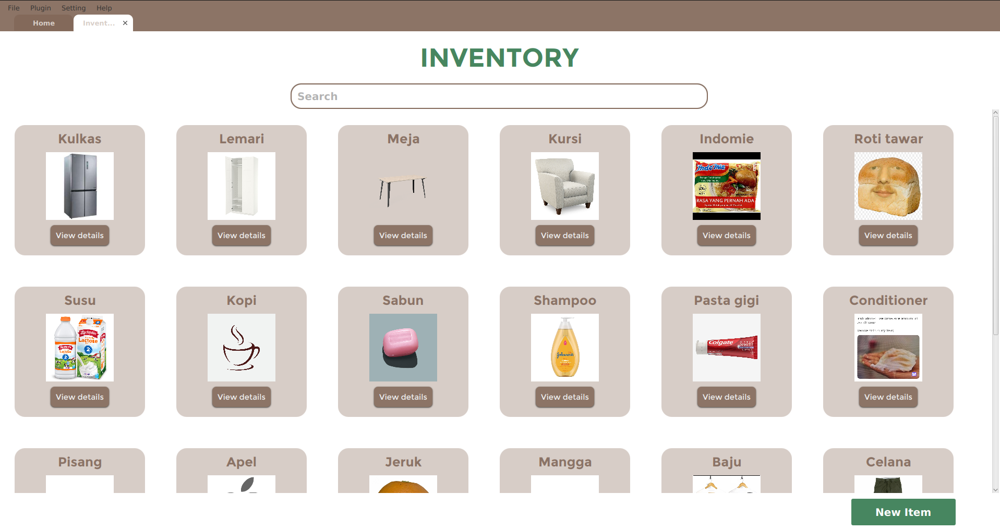
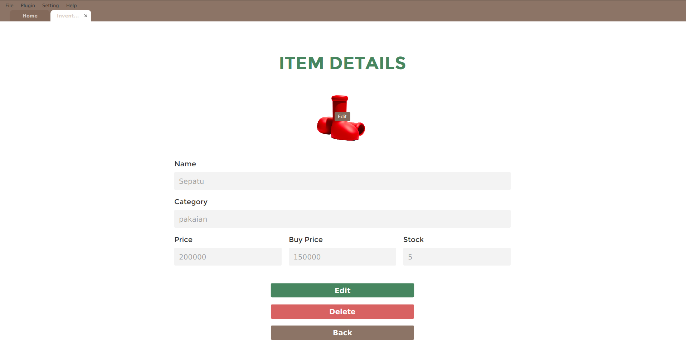
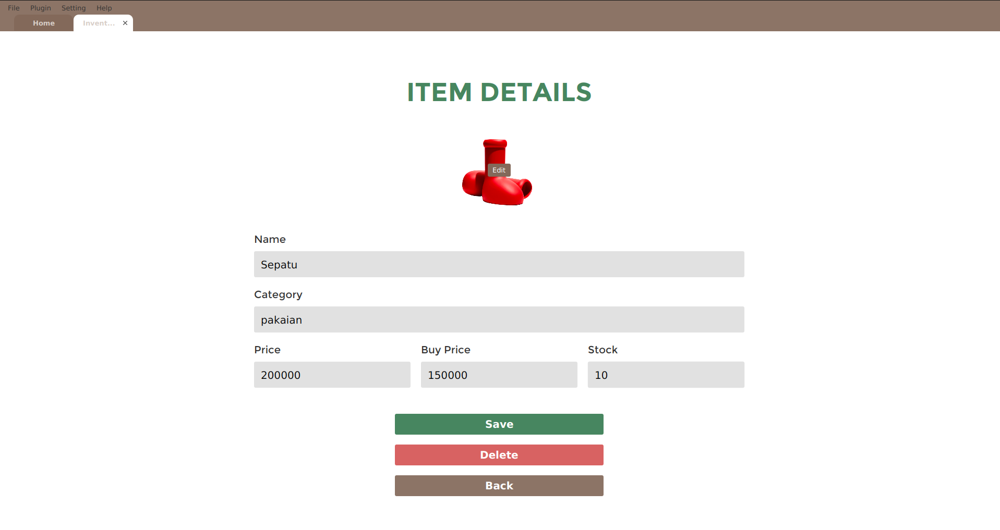
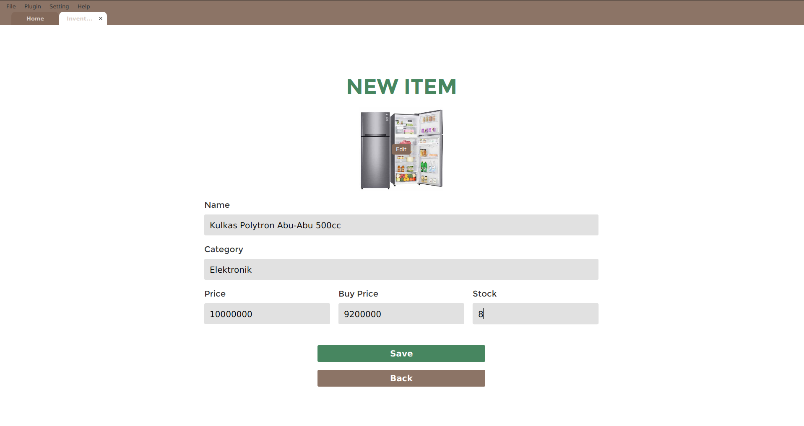
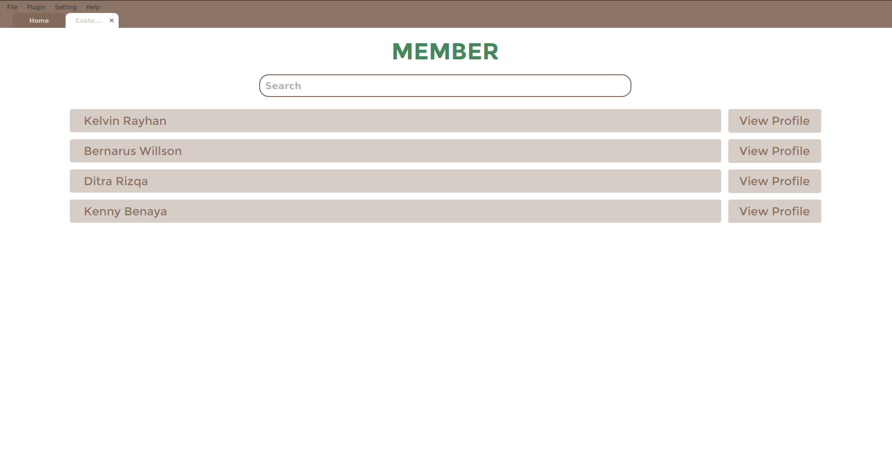
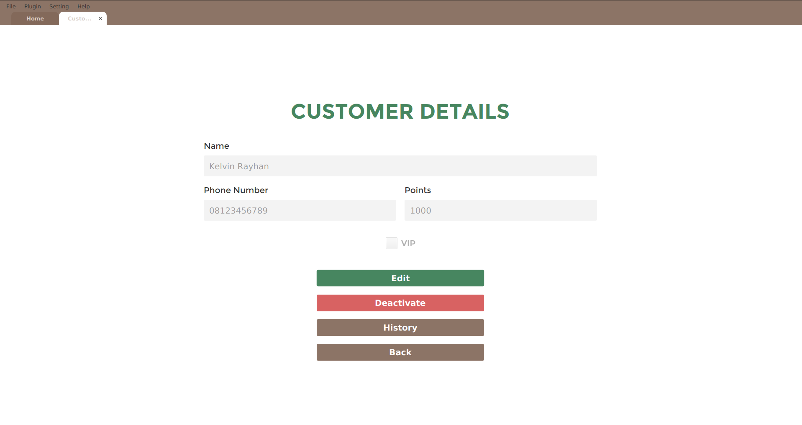
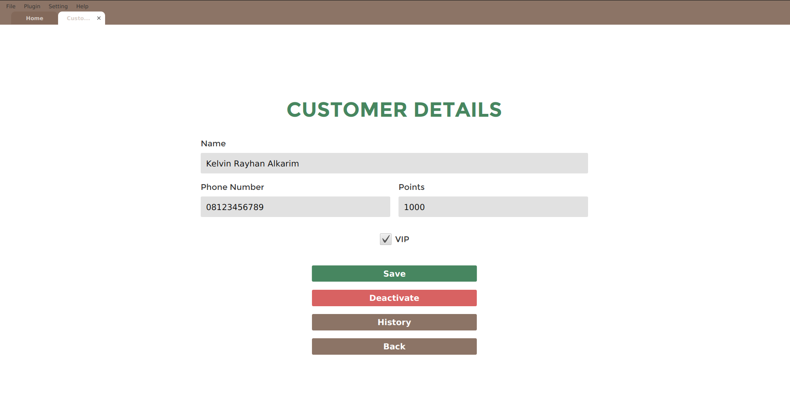

<!-- LOGO -->
<br />
<div align="center">
  <a href="https://github.com/ditramadia/IF2210_TB2_NGE">
    
  </a>

<h3 align="center">GANGGUAN JAWA</h3>

  <p align="center">
    Tugas Besar 2
    <br />    
    IF2210 Object Oriented Programming
    <br />
    <a href="https://github.com/ditramadia/Tucil3_13521005_13521019/blob/main/doc/Tucil3_13521005_13521019.pdf"><strong>Laporan »</strong></a>
    <br />
    <br />
  </p>
</div>

<!-- TABLE OF CONTENTS -->
<details>
  <summary>Table of Contents</summary>
  <ol>
    <li>
        <a href="#about-the-project">About The Project</a>
        <ul>
            <li><a href="#specification">Features</a></li>
            <li><a href="#built-with">Built With</a></li>
            <li><a href="#project-structure">Project Structure</a></li>
        </ul>
    </li>
    <li>
        <a href="#getting-started">Getting Started</a>
        <ul>
            <li><a href="#prerequisites">Prerequisites</a></li>
            <li><a href="#installation">Installation</a></li>
        </ul>
    </li>
    <li>
        <a href="#usage">Usage</a>
    </li>
    <li>
        <a href="#authors">Author</a>
    </li>
  </ol>
</details>
<br/>
<br/>

<!-- ABOUT THE PROJECT -->
## About The Project

[![Product Name Screen Shot][product-screenshot]](https://github.com/ditramadia/Tucil3_13521005_13521019)

Tubes 2 of Object Oriented Programming (IF2210). A point of sales desktop application built with java.

### Features

* Homepage with digital clock using thread
* Transaction records management
* Inventory management system
* Customers management system
* Datastore setting
* Multiple database format options (JSON, XML, and OBJ)

### Built With

* 

### Project Structure
```ssh
.
├─── README.md
├─── public                                 # Public assets
├─── saves                                  # Default database directory
├─── src                                    # Source code
│    ├── asset                              # Images
│    └── main
│        └─── java
│            └─── com.example.if2210_tb2_nge
│                ├─── adapter               # Database adapter
│                ├─── components            # GUI components
│                ├─── controller            # Logic
│                ├─── entity                # Entities
│                ├─── pages                 # GUI pages
│                ├─── repository            # Database repository
│                ├─── style                 # GUI stylesheet
│                └─── NgeApp.java           # Main application
├─── src                                    # Binary files
└───doc                                     # Documentation
```
<br/>
<br/>

<!-- GETTING STARTED -->
## Getting Started

### Dependencies
* JVM
* JavaFX
* projectlombok.lombok
* google.code.gson
* googlecode.json.simple
* itest.json.simple.parser
* jackson-dataformat-xml

### Installation
1. Clone the repo
   ```sh
   git clone https://github.com/ditramadia/IF2210_TB2_NGE
   ```
2. Go to the repository root folder `IF2210_TB2_NGE`
   ```sh
   cd IF2210_TB2_NGE
   ```
3. Run the program `NgeApp.jar`
   ```sh
   java NgeApp
   ```
<br/>
<br/>

<!-- USAGE -->
## Usage

### Inventory Management
1. Inventory
   <br/>
   <br/> 
   <br/>
   <br/>
2. View item detail
   <br/>
   <br/> 
   <br/>
   <br/>
3. Edit item detail
   <br/>
   <br/> 
   <br/>
   <br/>
4. Add item
   <br/>
   <br/> 
   <br/>
   <br/>

### Customer Management
1. Customers list
   <br/>
   <br/> 
   <br/>
   <br/>
2. View customer profile
   <br/>
   <br/> 
   <br/>
   <br/>
3. Edit customer profile
   <br/>
   <br/> 
   <br/>
   <br/>
4. View customer purchase history
   <br/>
   <br/> 
   <br/>
   <br/>
5. Add new customer
   <br/>
   <br/> 
   <br/>
   <p>*You can only add customer after adding a transaction record. See Transaction Records Management</p>
   <br/>
   <br/>

### Transaction Records Management
1. Add new transaction record
   <br/>
   <br/> 
   <br/>
   <br/> 
   <br/>
   <br/> 
   <br/>
   <br/> 
   <br/>
   <br/>

### Database Settings
1. Database directory and format
   <br/>
   <br/> 
   <br/>
   <br/>


<!-- AUTHOR -->

## Authors

|   NIM    |          Name          |
|:--------:|:----------------------:|
| 13521005 | Kelvin Rayhan Alkarim  |  
| 13521019 |   Ditra Rizqa Amadia   |
| 13521020 | Varraz Hazzandra Akbar |
| 13521021 |   Bernardus Willson    |
| 13521022 |  Raditya Naufal Abiyu  |
| 13521023 |  Kenny Benaya Nathan   |

<!-- MARKDOWN LINKS & IMAGES -->
<!-- https://www.markdownguide.org/basic-syntax/#reference-style-links -->
[product-screenshot]: public/home-page.png
